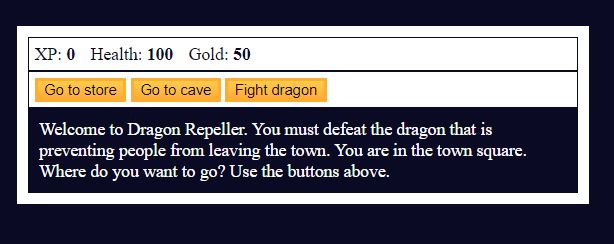
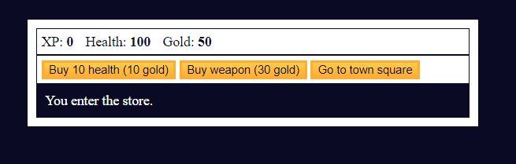
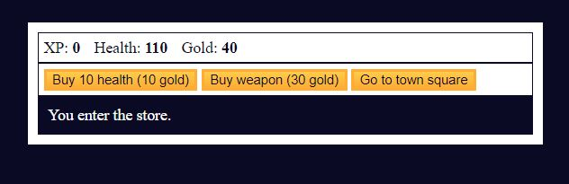
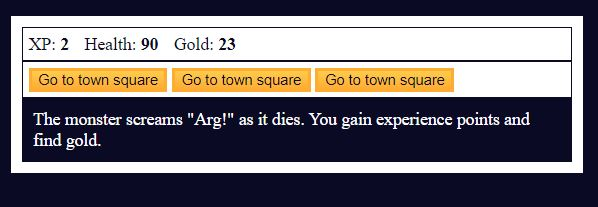

Sure! Here's an updated description note with a mention of a sample screenshot:

---

## RPG - Dragon Repeller Game

Welcome to the Dragon Repeller game repository! This project is a simple, browser-based RPG where players must defeat a dragon to save the town. The game involves navigating various locations, fighting monsters, upgrading weapons, and managing health and gold.

### Project Overview

#### HTML (`index.html`)
The HTML file sets up the basic structure of the game interface, including:
- **Player Stats**: Displays current XP, health, and gold.
- **Game Controls**: Provides buttons for navigating the game (e.g., going to the store, cave, or fighting the dragon).
- **Monster Stats**: Displays information about the current monster being fought.
- **Narrative Text**: Shows descriptive text guiding the player through the game.

#### CSS (`styles.css`)
The CSS file styles the game interface, ensuring a cohesive look and feel:
- **Dark Theme**: Uses a dark background with contrasting text for readability.
- **Layout**: Centers the game container and defines the appearance of various elements.
- **Button Styles**: Enhances the buttons with hover effects and distinct colors.

#### JavaScript (`script.js`)
The JavaScript file contains the core game logic and functionality:
- **Player Management**: Tracks XP, health, gold, and inventory.
- **Navigation**: Allows players to move between different locations like the town square, store, and cave.
- **Combat System**: Handles fighting mechanics, including attacking, dodging, and running away from monsters.
- **Store Transactions**: Enables purchasing health and weapons, and selling items.
- **Game States**: Manages win/loss conditions and special events (e.g., easter eggs).

### Key Features
- **Dynamic Updates**: Player and monster stats are updated in real-time based on interactions.
- **Random Events**: Includes chances for weapon breaks and special mini-games.
- **Inventory Management**: Players can upgrade and sell weapons, affecting combat effectiveness.
- **Responsive Controls**: Buttons dynamically update based on the current game state.

### Getting Started
To run the game locally:
1. Clone the repository: `git clone https://github.com/your-username/dragon-repeller.git`
2. Open `index.html` in your preferred web browser.

Feel free to explore the code, suggest improvements, or contribute new features. Enjoy playing and enhancing the Dragon Repeller game!

### Sample Screenshot

*(Include a screenshot of the game interface here)*

### Contributions
We welcome contributions! If you'd like to contribute to the project, please fork the repository, create a new branch, and submit a pull request. For major changes, please open an issue first to discuss what you would like to change.

---

Thank you for checking out the Dragon Repeller game! Happy coding and monster slaying!
